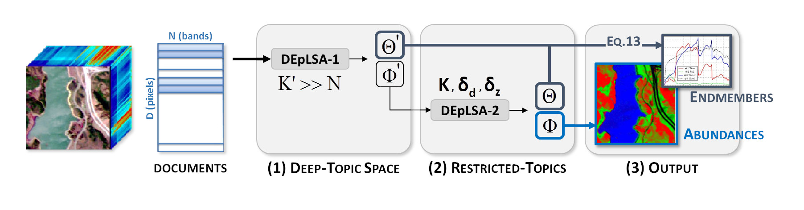

# Hyperspectral Unmixing Based on Dual-Depth Sparse Probabilistic Latent Semantic Analysis

[Ruben Fernandez-Beltran](https://scholar.google.es/citations?user=pdzJmcQAAAAJ&hl=es), [Antonio Plaza](https://sites.google.com/view/antonioplaza), [Javier Plaza](https://www2.umbc.edu/rssipl/people/jplaza/), [Filiberto Pla](https://scholar.google.es/citations?user=mSSPcAMAAAAJ&hl=es)
---

This repo contains the codes for the paper: [Hyperspectral Unmixing Based on Dual-Depth Sparse Probabilistic Latent Semantic Analysis](https://ieeexplore.ieee.org/abstract/document/8376003). This paper presents a novel approach for spectral unmixing of remotely sensed hyperspectral data. It exploits probabilistic latent topics in order to take advantage of the semantics pervading the latent topic space when identifying spectral signatures and estimating fractional abundances from hyperspectral images. Despite the contrasted potential of topic models to uncover image semantics, they have been merely used in hyperspectral unmixing as a straightforward data decomposition process. This limits their actual capabilities to provide semantic representations of the spectral data. The proposed model, called dual-depth sparse probabilistic latent semantic analysis (DEpLSA), makes use of two different levels of topics to exploit the semantic patterns extracted from the initial spectral space in order to relieve the ill-posed nature of the unmixing problem. In other words, DEpLSA defines a first level of deep topics to capture the semantic representations of the spectra, and a second level of restricted topics to estimate endmembers and abundances over this semantic space. An experimental comparison in conducted using the two standard topic models and the seven state-of-the-art unmixing methods available in the literature. Our experiments, conducted using four different hyperspectral images, reveal that the proposed approach is able to provide competitive advantages over available unmixing approaches.





## Usage

<!-- (comming soon) -->

`./codes/deplsa_1/run_pLSA.sh` is the script for DEpLSA-1 stage.  
`./codes/deplsa_2/run_pLSA.sh` is the script for DEpLSA-2 stage.  


## Citation

```
@article{fernandez2018hyperspectral,
  title={Hyperspectral unmixing based on dual-depth sparse probabilistic latent semantic analysis},
  author={Fernandez-Beltran, Ruben and Plaza, Antonio and Plaza, Javier and Pla, Filiberto},
  journal={IEEE Transactions on Geoscience and Remote Sensing},
  volume={56},
  number={11},
  pages={6344--6360},
  year={2018},
  publisher={IEEE}
}
```


## References

[1] Bioucas-Dias, J. M., Plaza, A., Dobigeon, N., Parente, M., Du, Q., Gader, P., & Chanussot, J. (2012). Hyperspectral unmixing overview: Geometrical, statistical, and sparse regression-based approaches. IEEE journal of selected topics in applied earth observations and remote sensing, 5(2), 354-379.
